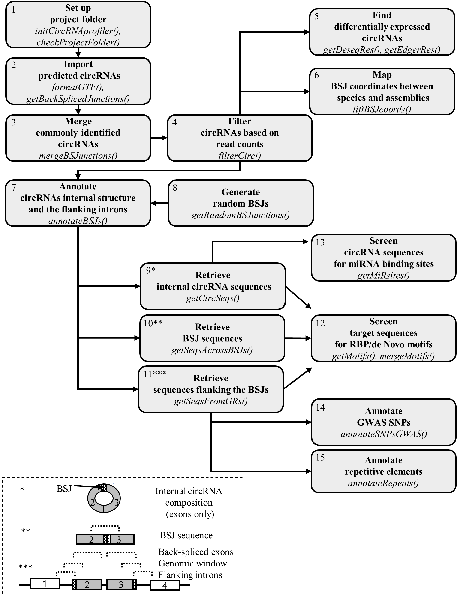
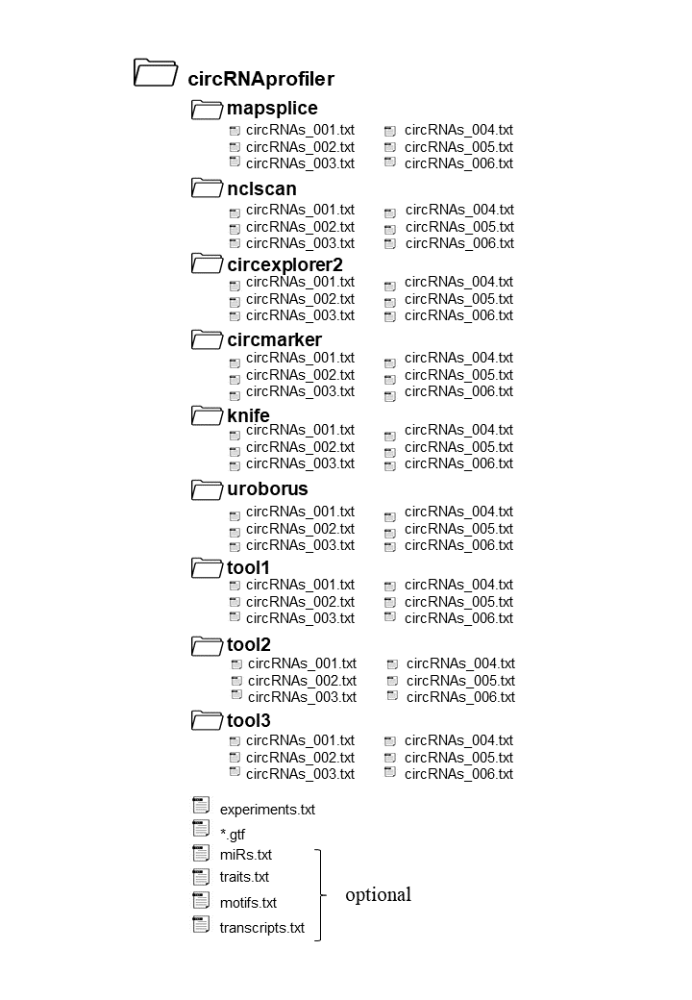

```{r, global_options, include = FALSE}
library(knitr)
knitr::opts_chunk$set(fig.path='figs/', warning=FALSE, message=FALSE, collapse=TRUE)
source("render_toc.R")
```

## Table of Contents

```{r, toc, echo = FALSE}
render_toc("circRNAprofiler.Rmd")
```

<style>
body {
text-align: justify}
</style>

## Introduction

circRNAprofiler is an R-based framework that only requires an R installation
and offers 15 modules for a comprehensive in silico analysis of circRNAs. 
This computational framework allows to combine and analyze circRNAs previously
detected by multiple publicly available annotation-based circRNA detection tools.
It covers different aspects of circRNAs analysis from differential expression
analysis, evolutionary conservation, biogenesis to functional analysis. The 
pipeline used by circRNAprofiler is highly automated and customizable. 
Furthermore, circRNAprofiler includes additional functions for data 
visualization which facilitate the interpretation of the results.

```{r, echo=FALSE, out.width='70%', fig.align="center", fig.cap="\\label{fig:figs} Figure 1: Schematic representation of the circRNA analysis workflow implemented by circRNAprofiler. The grey boxes represent the 15 modules with the main R-functions reported in italics. The different type of sequences that can be selected are depicted in the dashed box. BSJ, Back-Spliced Junction."}


```

This vignettes provides a guide of how to use the R package circRNAProfiler.

As practical example the RNA-sequencing data from human left ventricle tissues
previously analyzed by our group for the presence of circRNAs [@Khan.etal2016], 
was here re-analyzed. Multiple detection tools (CircMarker(cm), MapSplice2 (ms)
and NCLscan (ns)) were used this time for the detection of circRNAs and an additional 
sample for each condition was included reaching a total of 9 samples: 3 control
hearts, 3 hearts of patients with dilated cardiomyopathies (DCM) and 3 hearts with
hypertrophic cardiomyopathies (HCM).**After the circRNA detection
we locally setup the project folder as described in Module 1 and ran through 
Modules 2 and 3 to generate the data object backSplicedJunctions and mergedBSJunctions
which can be loaded and used as an example in the package vignettes.** 

Raw RNA sequencing data are available at NCBI BioProject accession number 
PRJNA533243.

## Install the package

First install:
```{r, eval = FALSE}
if (!requireNamespace("BiocManager", quietly = TRUE)){
  install.packages("BiocManager")
}
    
```

You can install circRNAprofiler from Bioconductor using:
```{r, eval = FALSE}
BiocManager::install("circRNAprofiler")
```

To download the latest development version use:
```{r, eval = FALSE}
# The following initializes usage of Bioc devel
BiocManager::install(version='devel')

BiocManager::install("circRNAprofiler")
```

## Load the package
```{r}
library(circRNAprofiler)

# Packages needed for the vignettes
library(ggpubr)
library(ggplot2)
library(VennDiagram)
library(gridExtra)
```

## Running circRNAprofiler

### Module 1 - Set up project folder

#### _initCircRNAprofiler()_

An important step of the analysis workflow is to initialize the project folder,
which can be done with the helper function initCircRNAprofiler()
available in the package. The project folder should be structured as in the
example Figure 2 if seven detection tools are used to detect circRNAs in 
6 samples.

```{r, echo=FALSE, out.width='55%', fig.align="center", fig.cap="\\label{fig:figs} Figure 2: Example of a project folder structure"}

```

**_Helper function_**

Project folder contains project files and circRNA prediction results.
In detail, project files include the genome-annotation file (.gtf), the file 
containing information about the experimental design (experiment.txt) and 
optional files (motifs.txt, miRs.txt, transcripts.txt, traits.txt) which contain
user specifications that are used to customize the analysis to execute. 
In order to initialize the project folder the helper function initCircRNAprofiler()
can be used to streamline the process. To initialize the project folder run the 
following command specifying the tools used to predict circRNAs. The following 
options are allowed: "mapsplice", "nclscan", "knife", "circexplorer2", 
"uroborus", "circmarker", "tool1", "tool2" or "tool3". The last 3 options are for 
unsupported tools. For now, a maximum of 3 unsupported tools can be used.
The function will automatically create the project folder with the
corresponding subfolders named as the circRNA detection tools used, and the 
5 *.txt files templates with the corresponding headers. These files should be 
filled with the appropriate information (see files description below).

If only MapSplice is used for the circRNA detection run the following command:

```{r, eval = FALSE }
initCircRNAprofiler(projectFolderName = "projectCirc", detectionTools =
                      "mapsplice")
```

If circRNA detection is performed by using multiple detection tools then run
the command with the name of the detection tools used, e.g.:

```{r, eval = FALSE}
initCircRNAprofiler(
    projectFolderName = "projectCirc",
    detectionTools = c("mapsplice", "nclscan", "circmarker")
)
```

<span style="color:red">**IMPORTANT**</span>

<span style="color:red">**Next, set project folder projectFolderName (in this case projectCirc) 
as your working directory.**</span>


**_Project files description_**

The file **experiment.txt** contains the experiment design information.
It must have at least 3 columns with headers (tab separated):

- label (1st column): unique names of the samples (short but informative).

- fileName (2nd column): name of the input files - e.g. circRNAs_X.txt, where 
x can be can be 001, 002 etc.

- condition (3rd column): biological conditions - e.g. A or B; healthy or diseased 
if you have only 2 conditions.

The functions for the filtering and the differential expression analysis depend
on the information reported in this file. The differential expression analysis 
is performed by comparing the condition positioned forward against the conditions
positioned backward in the alphabet (column condition of experiment.txt), so that,
circRNAs with positive log2FC are up-regulated in condition B compared to 
condition A (and vice versa for circRNA with negative log2FC).

```{r, echo=FALSE}
experiment <-
    read.table(
        "experiment.txt",
        header = TRUE,
        stringsAsFactors = FALSE,
        sep = "\t"
    )
head(experiment)
```

The file ***.gtf** contains the genome annotation. circRNAprofiler works well 
and was tested with ensamble gencode, UCSC or NCBI based-genome annotations. 
It is suggested to use the same annotation file used during the read mapping 
procedure. 

The file **motifs.txt (optional)** contains motifs/regular expressions specified by the user.
It must have 3 columns with header (tab separated):

- id (1st column): name of the motif. - e.g. RBM20 or motif1.
 
- motif (2nd column): motif/pattern to search.
 
- length (3rd column): length of the motif.

If this file is absent or empty only the motifs of RNA Binding Proteins in the 
ATtRACT database [@Giudice.etal2016] are considered in the motifs analysis.

```{r, echo=FALSE}
motifs <-
    read.table(
        "motifs.txt",
        stringsAsFactors = FALSE,
        header = TRUE,
        sep = "\t"
    )
head(motifs)

```

The file **traits.txt (optional)** contains diseases/traits specified by the user. It must 
have one column with header id. Type data("gwasTraits") to have an image (dated 
on the 31st October 2018) of the traits reported in the GWAS catalog 
[@MacArthur.etal2017]. The GWAS catalog is a curated collection of all
published genome-wide association studies and contains~ 90000 unique SNP-trait 
associations. If the file traits.txt is absent or empty, all SNPs associated with
all diseases/traits in the GWAS catalog are considered in the SNPs analysis.

```{r, echo=FALSE}
traits <-
    read.table(
        "traits.txt",
        stringsAsFactors = FALSE,
        header = TRUE,
        sep = "\t"
    )
head(traits)
```

The file **miRs.txt (optional)** contains the microRNA ids from miRBase [@Griffiths-Jones.etal2006]
specified by the user. It must have one column with header id. The first row
must contain the miR name starting with the ">", e.g >hsa-miR-1-3p. The 
sequences of the miRs will be automatically retrieved from the mirBase latest 
release or from the given mature.fa file,  that should be present
in the project folder. If this file is absent or empty, all miRs of the specified 
species are considered in the miRNA analysis.

```{r, echo=FALSE}
miRs <-
    read.table(
        "miRs.txt",
        header = TRUE,
        stringsAsFactors = FALSE,
        sep = "\t"
    )
head(miRs)
```

The file **transcripts.txt (optional)** contains the transcript ids of the circRNA host 
genes. It must have one column with header id. If this file is empty 
the longest transcript of the circRNA host genes whose exon coordinates overlap 
with that of the detected back-spliced junctions are considered in the 
annotation analysis.

```{r, echo=FALSE}
transcripts <-
    read.table(
        "transcripts.txt",
        header = TRUE,
        stringsAsFactors = FALSE,
        sep = "\t"
    )
head(transcripts)

```

**_circRNA prediction results_**

The **circRNAs_X.txt** contains the detected circRNAs. Once the project folder 
has been initialized the circRNAs_X.txt file/s must go in the corresponding 
subfolders. There must be one .txt file per sample named circRNAs_X.txt, 
where X can be 001, 002 etc. If there are 6 samples, 6 .txt files named 
circRNAs_001.txt, circRNAs_002.txt, circRNAs_003.txt, circRNAs_004.txt, 
circRNAs_005.txt, circRNAs_006.txt must be present in each 
subfolder named as the name of the tool that has been used for the circRNA 
detection. If the detection tool used is mapsplice, nclscan, knife, circexplorer2,
uroborus or circmarker, the only thing to do after the detection is to rename 
the files to circRNAs_X.txt and put them in the corresponding subfolder. 
A specific import function will be called internally to adapt and format the 
content as reported below.

In detail circRNAprofiler has been tested on the following output files:
MapSplice2-v2.2.0 output file (circularRNAs.txt),NCLscan v1.4 output file 
(e.g. MyProject.result),circExplorer2 v2.3.4 output file (circularRNA_full.txt),
KNIFE v1.5 output file (circJuncProbs.txt),CircMarker (July.24.2018) output file 
(Brief_sum.txt),UROBORUS v2.0.0 output file (circRNA_list.txt).

If the tool is not mapsplice, nclscan, knife, circexplorer2, uroborus or 
circmarker, first check that the tool used is an annotation-based circRNA 
detection tool, then rename the files to circRNAs_X.txt and put them in the 
subfolders "tool1", "tool2" or "tool3". In these last cases, you must ensure that 
each circRNAs_X.txt file must have at least the following 6 columns 
with the header (tab separated):

- chrom: represents the chromosome from which the circRNA is derived.

- gene: represents the gene from which the circRNA arises.

- strand: is the strand where the gene is transcribed.

- startUpBSE: is the 5' coordinate of the upstream 
back-spliced exon in the transcript. This corresponds with the back-spliced junction / 
acceptor site.

- endDownBSE: is the 3' coordinate of the downstream 
back-spliced exon in the transcript. This corresponds with the back-spliced junction / 
donor site.

- coverage: corresponds to the number of reads mapping to the 
back-spliced junction in the sample. 

E.g.
```{r, echo=FALSE}
circRNApredictions <-
    read.table(
        "circRNAs_test.txt",
        header = TRUE,
        stringsAsFactors = TRUE,
        sep = "\t"
    )
head(circRNApredictions)

```

NOTE:
If more columns are present they will be discared.

The coordinates for startUpBSE and endDownBSE are relative to the reference 
strand, i.e. if strand is positive startUpBSE < endDownBSE, if strand is 
negative startUpBSE > endDownBSE.

The circRNAprofiler package can be extended in the future with
further import functions specifically designed to import the output files of
the different circRNA detection tools. At the moment only import functions for
circRNA detection from annotation-based circRNA detection tools (e.g. MapSplice2,
NCLscan, CircMarker, CircExplorer2, KNIFE, UROBORUS) are supported.


<span style="color:red">For example purpose a project folder named **projectCirc** 
was created in **inst/extdata** folder of the R package circRNAprofiler as specified 
by Module 1. The project folder projectCirc contains a **short version of the raw
files containing the detected circRNAs** and the 
**optional files motifs.txt, miRs.txt, transcripts.txt and traits.txt.**</span>

<span style="color:red">**Alternatively** load the data object backSplicedJunctions 
and mergedBSJunctions containing the whole set of circRNAs detected
in the heart and specify the path to experiment.txt.</span>

```{r, eval=FALSE}
# Path to experiment.txt
pathToExperiment <- system.file("extdata", "experiment.txt",
                                package ="circRNAprofiler")


```


<span style="color:red">**Note: The user should download gencode.V19.annotation.gtf 
from https://www.gencodegenes.org/ and put it in the working directory projectCirc.
Next, set projectCirc as working directory and ran Module 2.**</span>

<span style="color:red">A short version of the above .gtf file has been 
generated and can be use for example purpose.</span>


#### _checkProjectFolder()_

The function checkProjectFolder() helps to verify that the project folder is 
set up correctly.  It checks that the mandatory files 
( .gtf file, the folders with the circRNAs_X.txt files and experiment.txt)
are present in the working directory.

```{r, eval = FALSE}
# Set project folder projectCirc as your working directory and run:
check <- checkProjectFolder()
check
```

If the project folder is set up correctly, check should be equal to 0.


### Module 2 - Import predicted circRNAs

#### _formatGTF()_

The function formatGTF() formats the given annotation file from ensemble, gencode,
UCSC or NCBI. The gtf object is then used in other functions. 

Type ?formatGTF for more information about the argument of the function and its
example.

```{r}
# Set project folder projectCirc as your working directory.
# Download gencode.V19.annotation.gtf from https://www.gencodegenes.org/ and 
# put it in the working directory, then run:
# gtf <- formatGTF("gencode.V19.annotation.gtf")

# For example purpose load a short version of the formatted gtf file generated
# using the command above.
data("gtf")
head(gtf)

```


#### _getBackSplicedJunctions()_

The function getBackSplicedJunctions() reads the circRNAs_X.txt (stored in the 
specified subfolders), adapts the content and generates a unique data frame with
the circRNAs detected by each detection tool and the occurrences found in each
sample. 

Type ?getBackSplicedJunctions for more information about the arguments of the 
function and its example.


```{r}
# Set working directory to projectCirc which contains a short version of the raw
# files containing the detected circRNAs. The run: 
# backSplicedJunctions <- getBackSplicedJunctions(gtf)

# Alternatively, you can load the object containing the whole set of circRNAs detected
# in the heart generated running the command above.
data("backSplicedJunctions")
head(backSplicedJunctions)
```

Plot the number of circRNAs identified by each detection tool.

```{r, fig.align="center", fig.width = 10, fig.height = 3}
# Plot
p <- ggplot(backSplicedJunctions, aes(x = tool)) +
    geom_bar() +
    labs(title = "", x = "Detection tool", y = "No. of circRNAs") +
    theme_classic()

# Run getDetectionTools() to get the code corresponding to the circRNA
# detection tools.
dt <- getDetectionTools() %>%
    dplyr::filter( name %in% c("mapsplice","nclscan", "circmarker"))%>%
    gridExtra::tableGrob(rows=NULL)

# Merge plots
gridExtra::grid.arrange(p, dt, nrow=1)
```

### Module 3 - Merge commonly identified circRNAs

#### _mergeBSJunctions()_

The function mergeBSJunctions() is called to shrink the data frame by grouping 
back-spliced junction coordinates commonly identified by multiple detection tools.
For the grouped back-spliced junction coordinates, the counts of the tool which 
detected the highest total mean across all analyzed samples will be taken. 
All the tools that detected the back-spliced junction are then listed in the 
column "tool" of the final table. Run getDetectionTools() to get the code
corresponding to each circRNA detection tool.

Since different detection tools can report slightly different coordinates
before grouping the back-spliced junctions, it is possible to fix the latter
using the gtf file. In this way the back-spliced junctions coordinates will
correspond to the exon coordinates reported in the gtf file. A difference of 
maximum 2 nucleodites is allowed between the bsj and exon coordinates.  
See param fixBSJsWithGTF.

You can run mergeBSJunctions() also if you used only 1 circRNA detection tool, 
or in this case you can also skip this step and use directly the backSplicedJunctions dataframe generated by getBackSplicedJunctions() in the downstream steps, e.g. in
filterCirc(), getDeseqRes(), liftBSJcoords(), annotateBSJs(). 

NOTE:

In this module circRNAs that derived from the antisense strand of the reported
gene are identified. In detail, in our pipeline a circRNA is defined 
antisense if the strand from which the circRNA arises (i.e. reported in the 
prediction results) is different from the strand where the gene is transcribed 
(i.e. reported in the genome annotation file). This might be explained by 
technical artifacts or by the presence of a gene transcribed from the opposite 
strand that is not annotated. Due to the ambiguous nature of these predictions 
the antisense circRNAs (if any) are removed from the dataset and if specified 
by the user they can be exported in a file (i.e. antisenseCircRNAs.txt) for user
consultation. Modules in circRNAprofiler are specific for the analysis of 
circRNAs that derive from the sense strand of the corresponding gene.


Type ?mergeBSJunctions for more information about the arguments of the function
and its example.

```{r}
# If you set projectCirc as your working directory, then run:
# mergedBSJunctions <- mergeBSJunctions(backSplicedJunctions, gtf)

# Alternatively, you can load the object containing the whole set of circRNAs 
# detected in the heart merged using the code above.
data("mergedBSJunctions")
head(mergedBSJunctions)

```

Plot commonly identified circRNAs.

```{r, fig.align = "center", fig.width = 10, fig.height = 4}
# Plot
p <- ggplot(mergedBSJunctions, aes(x = tool)) +
    geom_bar() +
    labs(title = "", x = "Detection tool", y = "No. of circRNAs") +
    theme_classic()

gridExtra::grid.arrange(p, dt, nrow=1)

```


### Module 4 - Filter circRNAs 

#### _filterCirc()_

The use of multiple detection tools leads to the identification of a higher number
of circRNAs. To rule out false positive candidates a filtering step can be applied
to the detected circRNAs.  The function filterCirc() filters circRNAs on
different criteria: condition and read counts. The user can decide the 
filtering criteria. In the example below by setting allSamples = FALSE the filter
is applied to the samples of each condition separately meaning that a circRNA 
is kept if at least 5 read counts are present in all samples of one of the 
conditions (A or B or C). If allSamples = TRUE, the filter is applied to all 
samples. We suggest to set allSamples = FALSE, since the presence
of a disease/treatment can decrease the expression of subset of circRNAs
thus by applying the filtering to all samples(allSamples = TRUE) those circRNAs 
are discarded. 

Type ?filterCirc for more information about the arguments of the function and 
and its example.

```{r}
# If you set projectCirc as your working directory, then run:
filteredCirc <-
filterCirc(mergedBSJunctions, allSamples = FALSE, min = 5)

```

Plot circRNAs after the filtering step.

```{r, fig.align="center", fig.width = 10, fig.height = 4}
# Plot
p <- ggplot(filteredCirc, aes(x = tool)) +
    geom_bar() +
    labs(title = "", x = "Detection tool", y = "No. of circRNAs") +
    theme_classic()

gridExtra::grid.arrange(p, dt, nrow=1)
```

Alternatively:

```{r, fig.align="center", fig.width = 5, fig.height = 4}
# Plot using Venn diagram
cm <- filteredCirc[base::grep("cm", filteredCirc$tool), ]
ms <- filteredCirc[base::grep("ms", filteredCirc$tool), ]
ns <- filteredCirc[base::grep("ns", filteredCirc$tool), ]

p <- VennDiagram::draw.triple.venn(
    area1 = length(cm$id),
    area2 = length(ms$id),
    area3 = length(ns$id),
    n12 = length(intersect(cm$id, ms$id)),
    n23 = length(intersect(ms$id, ns$id)),
    n13 = length(intersect(cm$id, ns$id)),
    n123 = length(Reduce(
        intersect, list(cm$id, ms$id, ns$id)
    )),
    category = c("cm", "ms", "ns"),
    lty = "blank",
    fill = c("skyblue", "pink1", "mediumorchid")
)

```

### Module 5 - Find differentially expressed circRNAs

#### _getDeseqRes()_

The helper functions getDeseqRes() identifies differentially expressed
circRNAs. The latter uses the R Bioconductor package DESeq2 which 
implement a beta-binomial model to model changes in circRNA expression. The 
differential expression analysis is performed by comparing the condition positioned
forward against the condition positioned backward in the alphabet (values in the 
column condition in experiment.txt). E.g. if there are 2 conditions A and B then 
a negative log2FC means that in the conditions B there is a downregulation of the
corresponding circRNA. If a positive log2FC is found means that there is an 
upregulation in the condition B of that circRNA.

Type ?getDeseqRes for more information about the arguments of the function and 
its example.

```{r}
# Compare condition B Vs A
# If you set projectCirc as your working directory, then run:
deseqResBvsA <-
    getDeseqRes(
        filteredCirc,
        condition = "A-B",
        fitType = "local",
        pAdjustMethod = "BH"
    )
head(deseqResBvsA)


```

```{r}
# Compare condition C Vs A
deseqResCvsA <-
    getDeseqRes(
        filteredCirc,
        condition = "A-C",
        fitType = "local",
        pAdjustMethod = "BH"
    )
head(deseqResCvsA)
```

Use volcanoPlot() function.

Type ?volcanoPlot for more information about the arguments of the function and 
its example.

```{r, fig.align="center", fig.height= 8, fig.width = 8}
# We set the xlim and ylim to the same values for both plots to make them
# comparable. Before setting the axis limits, you should visualize the 
# plots with the default values to be able to define the correct limits.
# An error might occur due to the log10 transformation of the padj values 
# (e.g. log10(0) = inf). In that case set setyLim = TRUE and specify the the 
# y limit manually.
p1 <-
    volcanoPlot(
        deseqResBvsA,
        log2FC = 1,
        padj = 0.05,
        title = "DCMs Vs. Con",
        setxLim = TRUE,
        xlim = c(-8 , 7.5),
        setyLim = TRUE,
        ylim = c(0 , 4),
        gene = FALSE
    )
p2 <-
    volcanoPlot(
        deseqResCvsA,
        log2FC = 1,
        padj = 0.05,
        title = "HCMs Vs. Con",
        setxLim = TRUE,
        xlim = c(-8 , 7.5),
        setyLim = TRUE,
        ylim = c(0 , 4),
        gene = FALSE
    )
ggarrange(p1, 
          p2, 
          ncol = 1, 
          nrow = 2)
```

#### _getEdgerRes()_

Alternatively, the helper functions edgerRes() can also be used to identifies
differentially expressed circRNAs. The latter uses the R Bioconductor package 
EdgeR which implement a beta-binomial model to model changes in circRNA expression.
The differential expression analysis is perfomed by comparing the condition positioned
forward against the condition positioned backward in the alphabet (values in the
column condition of experiment.txt). E.g. if there are 2 conditions A and B then
a negative log2FC means that in the conditions B there is a downregulation of 
the corresponding circRNA. If a positive log2FC is found means that there is 
an upregulation in the condition B of that circRNA.

Type ?getEdgerRes for more information about the arguments of the function and 
its example.

```{r,eval = FALSE}
# Compare condition B Vs A
edgerResBvsA <-
    getEdgerRes(
        filteredCirc,
        condition = "A-B",
        normMethod = "TMM",
        pAdjustMethod = "BH"    )
head(edgerResBvsA)
```

```{r,eval = FALSE}
# Compare condition C Vs A
edgerResCvsA <-
    getEdgerRes(
        filteredCirc,
        condition = "A-C",
        normMethod = "TMM",
        pAdjustMethod = "BH"
    )
head(edgerResCvsA)
```

### Module 6 - Map BSJ coordinates between species and genome assemblies

#### _liftBSJcoords()_

The function liftBSJCoords() maps back-spliced junction coordinates between
different species and genome assemblies by using the liftOver utility from UCSC.
Type data(ahChainFiles) to see all possibile options for annotationHubID 
E.g. if "AH14155" is specified, the hg19ToMm9.over.chain.gz will be used to 
convert the hg19 (Human GRCh37) coordinates to mm9 (Mouse GRCm37). 

NOTE:
Only back-spliced junction coordinates where the mapping was successful 
are reported. Back-spliced junction coordinates that could not be 
mapped might be not conserved between the analyzed species.

Type ?liftedBSJcoords for more information about the arguments of the function and 
its example.

```{r, eval = FALSE}
liftedBSJcoords <- liftBSJcoords(filteredCirc, map = "hg19ToMm9",
                                 annotationHubID = "AH14155")
```

### Module 7 - Annotate circRNAs internal structure and flanking introns   

#### _annotateBSJs()_

The function annotateBSJs() annotates circRNAs internal structure and the 
flanking introns. The genomic features are extracted from the user provided gene
annotation. We first define the circRNA parental transcript as a linear 
transcript whose exon coordinates overlap with that of the detected 
back-spliced junctions and then the features are extracted from the selected
transcript. Since the coordinates of the detected back-spliced junctions might
not exactly correspond to annotated exonic coordinates, the match is performed 
considering the back-spliced junction coordinates minus the last number. For example
if the coordinate is 1225359, then 122535 is used to detect the exon of the gene.
As default, in situations where genes have multiple transcripts 
whose exons align to the back-spliced junction coordinates, the transcript that 
will produce the longest sequence (exon only) will be selected. Alternatively,
the transcript to be used can be specified in transcripts.txt.
The output data frame will have the following columns:

- id: unique identifier.

- gene: represents the gene from which the circRNA arises.

- allTranscripts: are all transcripts of a circRNA's host gene which exon coordinates
overlap with the detected back-spliced junction coordinates.

- transcript: as default, this is the transcript producing the longest sequence
and whose exon coordinates overlap with the detected back-spliced junction coordinates.
The transcript reported in this column is used in the downstream analysis. 

- totExons: total number of exons in the selected transcript (reported in the column 
transcript)

- strand: is the strand from which the gene is transcribed.

- chrom: is the chromosome from which the circRNA is derived.

- startUpIntron: is the 5' coordinate of the intron immediately upstream the 
acceptor site in the selected transcript.

- endUpIntron: is the 3' coordinate of the intron immediately upstream the 
acceptor site in the selected transcript.

- startUpBSE: is the 5' coordinate of upstream back-spliced exon in the selected
transcript. This corresponds with the back-spliced junction / acceptor site.

- endUpBSE: is the 3' coordinate of the upstream back-spliced exon in the selected
transcript.

- startDownBSE: is the 5' coordinate of downstream back-spliced exon in the selected
transcript.

- endDownBSE: is the 3' coordinate of downstream back-spliced exon in the selected
transcript. This corresponds with the back-spliced junction / donor site.

- startDownIntron: is the 5' coordinate of the intron immediately downstream 
the donor site in the selected transcript.

- endDownIntron: is the 3' coordinate of the intron immediately downstream the
donor site in the selected transcript.

- exNumUpBSE: is the position of the upstream back-spliced exon in the selected
transcript (e.g. if it is the 1st, the 2nd etc).

- exNumDownBSE: is the position of the downstream back-spliced exon in the selected
transcript (e.g. if it is the 1st, the 2nd etc).

- numOfExons: is the total number of exons in the between the back-spliced junctions.

- lenUpIntron: is the length (nt) of the intron upstream the acceptor site 
in the selected transcript.

- lenUpBSE: is the length (nt) of the upstream back-spliced exon in the selected
transcript.

- lenDownBSE: is the length (nt) of the downstream back-spliced exon in the selected
transcript.

- lenDownIntron: is the length (nt) of the intron downstream the donor site 
in the selected transcript.

- meanLengthBSEs: is the mean lenght (nt) of the back-spliced exons.

- meanLengthIntrons: is the mean lenght (nt) of the introns flanking the 
detected back-spliced junctions.

- lenCircRNA: is the length (nt) of the circRNA. This is given by the length of 
the exons in between the back-spliced junctions, including the back-spliced exons.


NOTE:

NA values in the table can mean:

- the back-spliced exons are the first or the last within a transcript, so the
introns in these cases are not present.

- the back-spliced junctions do not match with any exon coordinates reported in 
the annotation file. It is important to use the same annotation file (*.gtf file)
used during the read mapping procedure since the same gene can be differently 
annotated by the existing annotation databases [@Zhao.Zhang2015].

Type ?annotateBSJs for more information about the arguments of the function and 
its example.

```{r}
# If you want to analysis specific transcripts report them in transcripts.txt (optional).
# If transcripts.txt is not present in your working directory specify pathToTranscripts.
# As default transcripts.txt is searched in the wd.

# As an example of the 1458 filtered circRNAs we annotate only the firt 30 
# circRNAs
annotatedBSJs <- annotateBSJs(filteredCirc[1:30,], gtf, isRandom = FALSE) 
head(annotatedBSJs)
```

### Module 8 - Generate random BSJs
 
#### _getRandomBSJunctions()_ 

The function getRandomBSJunctions() retrieves random back-spliced junctions 
from the user genome annotation.  Two random back-spliced exons are selected 
from each of the n randomly selected transcripts, and the back-spliced junction
coordinates reported in the final data frame. The frequency of single exon circRNAs 
can also be given as argument. If f = 10, 10% of the of the back-spliced junctions
belong to single exons. Randomly selected back-spliced junctions can be used as
background data set for structural and functional analysis. 

Type ?getRandomBSJunctions for more information about the arguments of the function and 
its example.

```{r}
# First find frequency of single exon circRNAs
f <-
    sum((annotatedBSJs$exNumUpBSE == 1 |
            annotatedBSJs$exNumDownBSE == 1) ,
        na.rm = TRUE) / (nrow(annotatedBSJs) * 2)

# Retrieve random back-spliced junctions
randomBSJunctions <-
    getRandomBSJunctions(gtf, n = nrow(annotatedBSJs), f = f, setSeed = 123)
head(randomBSJunctions)
```

Annotate randomly selected back-spliced junctions.

```{r, eval = FALSE} 
annotatedRBSJs <- annotateBSJs(randomBSJunctions, gtf, isRandom = TRUE)
```

Use the plot functions to plot all the features of the annotated back-spliced-junctions.

Type ?plotLenIntrons ?plotLenBSEs ?plotHostGenes ?plotExBetweenBSEs ?plotExPosition
?plotTotExons for more information about the arguments of the functions 
and their examples.

```{r, fig.align="center", fig.width = 13, fig.height = 8, eval = FALSE}
# annotatedBSJs act as foreground data set
# annotatedRBSJs act as background data set

# Length of flanking introns
p1 <- plotLenIntrons(
    annotatedBSJs,
    annotatedRBSJs,
    title = "Length flanking introns",
    df1Name = "predicted",
    df2Name = "random",
    setyLim = TRUE, 
    ylim = c(0,7)
)

# Length of back-splided exons
p2 <- plotLenBSEs(
    annotatedBSJs,
    annotatedRBSJs,
    title = "Length back-splided exons",
    df1Name = "predicted",
    df2Name = "random",
    setyLim = TRUE, 
    ylim = c(0,7)
)

# No. of circRNAs produced from the host genes
p3 <-
    plotHostGenes(annotatedBSJs, title = "# CircRNAs produced from host genes")

# No. of exons in between the back-spliced junctions
p4 <-
    plotExBetweenBSEs(annotatedBSJs, title = "# Exons between back-spliced junctions")

# Position of back-spliced exons within the host transcripts
p5 <-
    plotExPosition(annotatedBSJs,
        n = 1,
        title = "Position back-spliced exons in the transcripts")

# Total no. of exons within the host transcripts
p6 <-
    plotTotExons(annotatedBSJs, title = " Total number of exons in the host transcripts")

# Combine plots
ggarrange(p1,
    p2,
    p3,
    p4,
    p5,
    p6,
    ncol = 2,
    nrow = 3)

```


```{r, echo=FALSE, out.width='100%', fig.align="center", fig.cap="\\label{fig:figs} Comparison of structural features extracted from the subset of 1458 filtered  back-spliced junctions compared to an equal number of randomly generated back-spliced junctions."}
knitr::include_graphics("./images/image3.png")
```

### **Retrieve target sequences**

Downstream screenings can be perfomed on one or multiple circRNAs (e.g 
differentially expressed circRNAs or circRNAs arising from the same host genes).
We selected ALPK2 circRNA for further downstream screenings.

```{r, eval = FALSE}
# Select ALPK2:-:chr18:56247780:56246046 circRNA
annotatedCirc <-
annotatedBSJs[annotatedBSJs$id == "ALPK2:-:chr18:56247780:56246046", ]

# As background data set we used all the remaining 1457 filered circRNAs.
# Alternatively the subset of randomly generated back-spliced junctions can be used.
annotatedBackgroundCircs <-
annotatedBSJs[which(annotatedBSJs$id != "ALPK2:-:chr18:56247780:56246046"), ]
```

CircRNA sequences, back-spliced junction sequences only or sequences flanking 
the back-spliced junctions can be analyze
The sequences are retrieved from UCSC database. Default query sequence corresponds
to the positive strand of the DNA (5'->3'). For all the circRNAs arising from 
genes located on the negative strand, the sequences are complemented and subsequently
reversed since the reference direction is 5'->3'. Sequences are only retrieved for
back-spliced junctions that overlap with exon boundaries of at least one 
transcript (see annotateBSJs()).  


```{r}
# All the sequences will be retrieved from the BSgenome package which contains 
# the serquences of the genome of interest
if (!requireNamespace("BSgenome.Hsapiens.UCSC.hg19", quietly = TRUE)){
  BiocManager::install("BSgenome.Hsapiens.UCSC.hg19")
}

# Get genome
genome <- BSgenome::getBSgenome("BSgenome.Hsapiens.UCSC.hg19")
```

### Module 9 - Retrieve internal circRNA sequences

#### _getCircSeqs()_

The function getCircSeqs() retrieves the internal circRNA sequences. By default,
the circRNA sequences are the sequences of all the exons between 
the back-spliced-junctions. The exon sequences are retrieved and then concatenated
together to recreate the circRNA sequence. To recreate the back-spliced junction 
sequence 50 nucleotides are taken from the 5' head and attached at the 3' tail 
of each circRNA sequence. 

Type ?getCircSeqs for more information about the arguments of the function and
its example.

```{r,eval = FALSE}

# Foreground target sequences
targetsFTS_circ <-
getCircSeqs(annotatedCirc, gtf, genome)

# Background target sequences
targetsBTS_circ <-
getCircSeqs(annotatedBackgroundCircs, gtf, genome)

```

The output is a list of 1 data frame containing the the following columns:

- id: unique identifier.	

- gene: represents the gene from which the circRNA arises.	

- transcript: transcript whose exon coordinates overlap with the detected 
back-spliced junction coordinate and used in the downstream analysis.	

- strand: is the strand from which the gene is transcribed.

- chrom: is the chromosome from which the circRNA is derived.	

- startGR: is the 5' coordinate of the genomic range from which the sequence are
extracted.

- endGR: is the 3' coordinate of the genomic range from which the sequence are
extracted.

- length: length of the extracted sequences. 
The circRNA sequences reported in the output file (column seq) are longer than 
the predicted length (column lenght), due to the 50 nucleotides attached 
at the 3' tail to recreate the back-spliced junction.

- seq: sequence used in the downstream analysis.

- type: type of sequences retrieved. In this case circ stands for circRNA.


### Module 10 - Retrieve BSJ sequences

#### _getSeqsAcrossBSJs()_

The function getSeqsAcrossBSJs() can be used to retrieve the sequences across
the back-spliced junctions.  A total of 11 nucleotides from each side of the
back-spliced junction are taken and concatenated together.

Type ?getSeqsAcrossBSJs for more information about the arguments of the function 
and its example.

```{r, eval = FALSE}
# Foreground target sequences
targetsFTS_bsj <-
    getSeqsAcrossBSJs(annotatedCirc, gtf, genome)

# Background target sequences
targetsBTS_bsj <-
getCircSeqs(annotatedBackgroundCircs, gtf, genome)

```

The output is a list of 1 data frame containing the the following columns:

- id: unique identifier.	

- gene: represents the gene from which the circRNA arises.	

- transcript: transcript whose exon coordinates overlap with the detected 
back-spliced junction coordinate and used in the downstream analysis.	

- strand: is the strand from which the gene is transcribed.

- chrom: is the chromosome from which the circRNA is derived.	

- startGR: is the 5' coordinate of the genomic range from which the sequence are
extracted.

- endGR: is the 3' coordinate of the genomic range from which the sequence are
extracted.

- length: length of the extracted sequences. For the back-spliced junctions this 
will be 22 nucleotides.

- seq: sequence used in the downstream analysis.

- type: type of sequences retrieved. In this case bsj stands back-spliced junctions.


### Module 11 - Retrieve sequences flanking the BSJs

#### _getSeqsFromGRs()_

The function getSeqsFromGRs() includes 3 modules to retrieve the 3 types of sequences:
i) sequences of the introns flanking back-spliced junctions, ii) sequences from a 
user-defined genomic window surrounding the back-spliced junctions and 
iii) sequences of the back-spliced exons. In detail, if type = "fi" the sequences
of the introns flanking the back-spliced exons are retrieved. If type = "ie" the
sequences are retrieved from the genomic window defined by using the values given
in input to lIntron and lExon. If type = "bse" the sequences of the back-spliced
exons will be extracted. 

Type ?getSeqsFromGRs for more information about the arguments of the function 
and its example.

```{r, eval = FALSE}
# Foreground target sequences
targetsFTS_gr <-
    getSeqsFromGRs(
        annotatedCirc,
        genome,
        lIntron = 200,
        lExon = 9,
        type = "ie"
        )
# Background target sequences.
targetsBTS_gr <-
    getSeqsFromGRs(
        annotatedBackgroundCircs,
        genome,
        lIntron = 200,
        lExon = 9,
        type = "ie")
```

The output is a list. Each element of the list is a dataframe with the following
columns:

- id: unique identifier.	

- gene: represents the gene from which the circRNA arises.	

- transcript: transcript whose exon coordinates overlap with the detected 
back-spliced junction coordinate and used in the downstream analysis.	

- strand: is the strand from which the gene is transcribed.

- chrom: is the chromosome from which the circRNA is derived.	

- startGR: is the 5' coordinate of the genomic range from which the sequence are
extracted.

- endGR: is the 3' coordinate of the genomic range from which the sequence are
extracted.

- length: length of the extracted sequences.

- seq: sequence used in the downstream analysis.

- type: type of sequences retrieved. See type argument of function getSeqsFromGRs().
If type = "fi" the sequences derive from introns flanking the back-spliced exons
If type = "ie" the sequences derive from the genomic window defined by 
using the values given in input to lIntron and lExon. 
If type = "bse" the sequences derive from back-spliced exons.

### **Screen target sequences**

### Module 12 - Screen target sequences for RBP/de Novo motifs

#### _getMotifs()_

The function getMotifs() scans the target sequences from module 9-11
for the presence of recurrent motifs of a specific length defined in input. 
Briefly, we first compute all possible motifs of a given length (defined by 
the argument width of the function), and then the target sequences are scanned
for the presence of those motifs. Also overlapping motifs are counted. 
The identified motifs can subsequently be matched with motifs of known RNA Binding 
Proteins (RBPs) deposited in the ATtRACT or MEME database. 
A motif identified in target sequences is selected if it matches with or it 
is part (as substring) of any RBP motifs deposited in the database. It is possible 
to specify whether to report only motifs matching with RBPs or unknown motifs. 
By setting rbp = TRUE, only motifs matching with known RBP motifs are reported.
By setting reverse = TRUE, all the RBP motifs in the ATtRACT or MEME database 
and custom motifs reported in motifs.txt are reversed and analyzed together
with the direct motifs as they are reported in the databases and motifs.txt. 
Location of the selected motifs is also reported. This corresponds to the start 
position of the motif within the sequence (1-index based).
If RBP analysis is performed on BSJ sequences only motifs crossing the back-spliced 
junctions with at least one nucleotide are reported. E.g. by setting width = 6,
the BSJ sequences retrieved using module 10 are trimmed so that only 5 nucleotides 
are left at each side of the BSJ. If width = 7, then 6 nucleotides are left at 
each side of the BSJ etc.

NOTE:

It might be that the URL of the databases from which the RBP motifs are 
retrieved can not be reached, in that case a message will be printed 
and only motifs reported in the motifs.txt will be used in the analysis. 

Type ?getMotifs for more information about the arguments of the function 
and its example.

```{r, eval = FALSE}
# If you want to analysis also custom motifs report them in motifs.txt (optional). 
# If motifs.txt is not present in your working directory specify pathToMotifs.
# As default motifs.txt is searched in the wd.

# E.g. in motifs.txt we added RBM20 consensus motif since it is not present in 
# the ATtRACT database.

# Find motifs in the foreground target sequences
motifsFTS_gr <-
    getMotifs(targetsFTS_gr,
              width = 6,
              database = 'ATtRACT',
              species = "Hsapiens",
              rbp = TRUE,
              reverse = FALSE)
# Find motifs in the background target sequences
motifsBTS_gr <-
    getMotifs(targetsBTS_gr,
              width = 6,
              database = 'ATtRACT',
              species = "Hsapiens",
              rbp = TRUE,
              reverse = FALSE)
```

 
The output is a list. Each element of the list has 4 elements.

- The first element (targets) is a dataframe containing the information 
of the target sequences. Columns are: id, gene, transcript, strand, chrom, startGR, 
endGR, length, seq, type. See above for a description of the column names.

- The second element (counts) is a dataframe containing the number of motifs found
in the target sequences. Each column corresponds to a motif.

- The third element (locations) is a dataframe containing the locations of the motifs.
Each column corresponds to a motif.

- The fourth element (motifs) is a dataframe containing the sequences of the 
motifs and the corresponding RBP.

#### _mergeMotifs()_

The function mergeMotifs() groups all the motifs recognized by the same RBP and 
report the total counts.

Type ?mergeMotifs for more information about the arguments of the function 
and its example.

```{r, eval = FALSE}
mergedMotifsFTS_gr <- mergeMotifs(motifsFTS_gr)
mergedMotifsBTS_gr <- mergeMotifs(motifsBTS_gr)
```

Retrieve and plot log2FC and counts of the motifs found in the target sequences 
(e.g. background and foreground). If the number or the length of the target sequences
is different then the counts should be normalized. Normalization can be done 
using the number or the total length of the target sequences (suggested).

Type ?plotMotifs for more information about the arguments of the function 
and its example.

```{r, fig.align="center", fig.width = 7, fig.height = 7, eval = FALSE}
# Plot log2FC and normalized counts

# Normalize using the number of target sequences. You can do this normalization if you
# analyzed the same number of target sequences and extracted the same number of 
# nucleotides from the latter.

# Alternatively you can use the length of the target sequences.
# If you are analyzing the flanking upstream and downstream sequences then normalize 
# using the length of the latters.E.g.:
# nf1 = sum(targetsFTS_gr$upGR$length, na.rm = T)+sum(targetsFTS_gr$downGR$length, na.rm = T)
# nf2 = sum(targetsBTS_gr$upGR$length, na.rm = T)+sum(targetsBTS_gr$downGR$length, na.rm = T)

# If you are analyzing the circRNA sequences then normalize using the length of 
# the latter. E.g.:
# nf1 = sum(targetsFTS_circ$circ$length, na.rm = T) 
# nf2 = sum(targetsBTS_circ$circ$length, na.rm = T)

# If you are analyzing the BSJ then normalize using the length of the latter. E.g.: 
# nf1 = sum(targetsFTS_bsj$bsj$length, na.rm = T)
# nf2 = sum(targetsBTS_bsj$bsj$length, na.rm = T)

p <-
    plotMotifs(
        mergedMotifsFTS_gr,
        mergedMotifsBTS_gr,
        nf1 = sum(targetsFTS_gr$upGR$length, na.rm = T)+sum(targetsFTS_gr$upGR$length, na.rm = T) , 
        nf2 = sum(targetsBTS_gr$upGR$length, na.rm = T)+sum(targetsBTS_gr$upGR$length, na.rm = T), 
        log2FC = 1,
        removeNegLog2FC = TRUE,
        df1Name = "circALPK2",
        df2Name = "Other circRNAs",
        angle = 45
    )
ggarrange(p[[1]],
          p[[2]],
          labels = c("", ""),
          ncol = 2,
          nrow = 1)

```

```{r, echo=FALSE, out.width='70%', fig.align="center", fig.cap="\\label{fig:figs} Bar chart showing the log2FC (cut-off = 1) and the normalized counts of the RBP motifs found in the region flanking the predicted back-spliced junction of circALPK2 compared to the remaining subset of 1457 filtered circRNAs."}
knitr::include_graphics("./images/image4.png")
```

```{r, eval = FALSE}
# Type p[[3]] to get the table
head(p[[3]])
```

The data frame contains the following columns:

- foreground: number of motifs found in the foreground target sequences 
(e.g. predicted circRNAs).

- background: number of motifs found in the background target sequences 
(e.g. randomly generated circRNAs).

- foregroundNorm: number of motifs found in the foreground target sequences (+1) 
divided by the number (or length) of sequences analyzed.

- backgroundNorm: number of motifs found in background target sequences (+1) 
divided by the number (or length) of sequences analyzed.

- log2FC: log2 fold change calculated in this way (foregroundNorm)/(backgroundNorm).

- motifF: motifs of the corresponding RBP found in the foreground sequences.

- motifB: motifs of the corresponding RBP found in the background sequences.

NOTE:

To avoid infinity as a value for fold change, 1 was added to number of occurences
of each motif found in the foreground and background target sequences before
the normalization.

It is also possible to search for RBP motifs and unknown motifs in circRNA 
sequences and back-spliced junction sequences. For this purpose the target sequences
have to be retrieved and then the functions getMotifs() and mergeMotifs() have 
to be run, as described above.


### Module 13 - Screen circRNA sequences for miRNA binding sites

#### _getMiRsites()_

The function getMirSites() searches miRNA binding sites within circRNA sequences.
Briefly, circRNAprofiler queries the miRBase database
and retrieves the miRNA sequences which are subsequently reversed (3'->5'). 
Each circRNA sequence is then scanned using a sliding window of 1, for the 
presence of putative matches with the miRNA seed sequence.  For each iteration, the number of 
total matches (canonical Watson-Crick (WC) + non-canonical matches), continuous 
canonical WC matches and non-canonical matches between the 2 given sequences 
(miRNA seed region and  miRNA seed region binding sites) are reported. circRNAprofiler 
compares the 2 sequences without gap and by introducing a gap in each position 
of one of the 2 sequences at the time to find a better alignment. 
A WC match occurs when adenosine (A) pairs with uracil (U)and guanine (G) pairs 
with cytosine (C). A perfect seed match has no gaps in alignment within the WC matching.
A non-canonical match occurs when a G matches with U. A mismatch occurs when there 
is a gap in one of the two aligned sequences (asymmetric mismatch or buldge)
or in the following cases (symmetric mismatch): A-G or A-C or U-C. Once the alignment is
performed and the number of matches collected, miRNA seed region binding sites are filtered 
based on the input settings and reported in the final output.
Of those binding sites, additional features are also reported.
These features are the number of matches found between the target sequences and the 
central and supplementary regions of the miRNA. Information about the nucleotide
at position 1 (t1), that is the nucleotide in the target sequence that matches 
with the nucleotide number 1 of the miRNA sequence.  Finally, the percentage of
AU nucleotides around the miRNA seed region binding sites is reported. 
The output is a list of data frames where each data frame contains the 
information relative to one circRNA. The following columns are present:

- miRseqRev: miRNA sequence used in the analysis; 
e.g. 3'GAUUCGGUGGUACACUUUGGUC5'; GUGG: compensatory region (13-16); 
UACA: central region (9-12); CUUUGGU: seed (8-2).

- counts: is the number of miRNA seed region binding sites found in 
the target sequence.

- totMatchesInSeed: is the number of total matches (canonical WC + non-canonical matches)
found between the miRNA seed region and the miRNA seed region binding site in 
the target sequence. The maximun number of possible matches is 7.

- cwcMatchesInSeed: is the number of continuous WC matches found between the miRNA
seed region and the miRNA seed region binding site in the target sequence.

- seedLocation: is the location of the miRNA seed region binding site in the 
target sequence. E.g. if the reported number is 20 it means that the nucleotide
at position 20 in the target sequence (1-index based) matches with the nucleotide
number 8 of the miRNA. From 21 to 26 one can find the rest of the seed sequence. 
For the central region one has to look from position 16 to 19 and for the 
compensatory region from position 12 to 15 of the target sequence.

- t1: is the nucleotide in the target sequence that matches with nucleotide 
number 1 (C5') of the miRNA sequence.

- totMatchesInCentral: is the number of total matches (canonical WC + non-canonical matches)
found between the miRNA central region and the sequence upstream the miRNA seed 
region binding site in the target sequence (e.g. position 16 to 19). 
The maximun number of possible matches is 4.

- cwcMatchesInCentral: is the number of continuous WC matches found between the 
miRNA central region and the sequence upstream the miRNA seed region binding site
in the target sequence (e.g. position 16 to 19).

- totMatchesInCompensatory: is the number of total matches found between the miRNA
compensatory region and the sequence upstream the miRNA seed region binding site
in the target sequence (e.g. position 12 to 15). 
The maximun number of possible matches is 4.

- cwcMatchesInCompensatory: is the number of continuous WC matches found between
the miRNA compensatory region and the region upstream the miRNA seed region 
binding site in the target sequence (e.g. position 12 to 15).

- localAUcontent: is the percentage of AU nucleotides in the 10 nucleotides upstream
and downstream the miRNA seed region binding site in the target sequence.


How to interpret the results?
The user can select stringency criteria for miRNA binding prediction. 
For example by setting the function arguments totalMatches = 7 and 
maxNonCanonicalMatches = 1, one can retrieve only miRNA seed region binding sites 
with a number of total matches with the miRNA seed region equal to 7 of 
which only 1 can be a non-canonical match. In this case after running the 
analysis, totMatchesInSeed must be 7, if cwcMatchesInSeed is 4mer it means 
that there are 7 matches between the miRNA seed region binding site in the target 
sequence and the miRNA seed region, with 1 non-canonical match in the middle of 
alignment, that is: there are 4 continuous WC matches (4mer), 1 non-canonical 
match and 2 continuous WC matches, for a total of 7. 

Furthemore, for the selected site, let's assume that for the central and 
compensatory region, the maximum number of matches found with the target sequence
is 4 for both of them. In this case if totMatchesInCentral is 4 but 
cwcMatchesInCentral is 3 it means that there are 3 continuous WC matches with
1 non-canonical match, for a total of 4. 
Alternatively if totMatchesInCentral is 3 but cwcMatchesInCentral is 2 it means
that there are 2 continuous WC matches, 1 non-canonical match for a total of 3 
and 1 gap. The same rule is valid for totMatchesInCompensatory and 
cwcMatchesInCompensatory.


The miRNA analysis starts at position 30 of the circRNA sequence to allow the 
analysis of the complementary and 3' supplementary region of the miRNA that have
to be aligned with the region located backwards the selected miRNA seed region 
binding site. The 30 nucleotides skipped in the initial phase are analyzed in 
the final phase together with the back-spliced junction. The computational time 
increases with the number of sequences and miRNAs to analyze. To reduce false 
positives and computational time we suggest making a selection on miRNAs, e.g. 
use only miRNAs expressed in the tissues of interest.

Th run time to analyze 1 circRNA sequence of length ~1700 nt for the presence of
360 miRs, is ~4h 20m.

NOTE:

It might be that the URL of miRBase database from which the miR sequences are 
retrieved can not be reached, in that case an error message will be printed and 
the analysis will stop. To proceed with the analysis set miRBaseLatestRelease
to FALSE. If FALSE is specified then a file named mature.fa containing fasta format
sequences of all mature miRNA sequences previously downloaded by the user from 
miRBase must be present in the working directory (e.g. projectCirc). 
The mature.fa will be read automatically by the module and used to extract the 
needed miR sequences. 

Type ?getMiRsites for more information about the arguments of the function 
and its example.

```{r,eval = FALSE}
# If you want to analysis only a subset of miRs, then specify the miR ids in 
# miRs.txt (optional).
# If miRs.txt is not present in your working directory specify pathToMiRs.
# As default miRs.txt is searched in the wd.
miRsites <-
    getMiRsites(
        targetsFTS_circ,
        miRspeciesCode = "hsa",
        miRBaseLatestRelease = TRUE,
        totalMatches = 6,
        maxNonCanonicalMatches = 1
    )
```

#### _rearrageMiRres()_

The function rearrangeMirRes() rearranges the results of the getMiRsites() 
function. Each element of the list contains the miR results relative to one 
circRNA. For each circRNA only miRNAs for which at least 1 miRNA
binding site is found are reported.

```{r,eval = FALSE}
rearragedMiRres <- rearrangeMiRres(miRsites)
```

Store results in an excel file

```{r, eval=FALSE}
# If multiple circRNAs have been analyzed for the presence of miR binding sites
# the following code can store the predictions for each circRNA in a 
# different sheet of an xlsx file for a better user consultation.
i <- 1
j <- 1
while (i <= (length(rearragedMiRres))) {
    write.xlsx2(
        rearragedMiRres[[i]][[1]],
        "miRsites_TM6_NCM1.xlsx",
        paste("sheet", j, sep = ""),
        append = TRUE
    )
    j <- j + 1
    write.xlsx2(
        rearragedMiRres[[i]][[2]],
        "miRsites_TM6_NCM1.xlsx",
        paste("sheet", j, sep = ""),
        append = TRUE
    )
    i <- i + 1
    j <- j + 1
}

```

The function plotMir() can be used to visualize the miR results of 1 circRNA 
at the time. By setting id = 1 the the miR results of the first element of the 
list rearragedMiRres are plotted.

Type ?plotMiR for more information about the arguments of the function 
and its example.

```{r, eval = FALSE}
# Plot miRNA analysis results

p <- plotMiR(rearragedMiRres,
             n = 40,
             color = "blue",
             miRid = TRUE,
             id = 1)
p
```


### **Annotate target sequences**

### Module 14 - Annotate GWAS SNPs

#### _annotateSNPsGWAS()_

The function annotateSNPsGWAS() can be used to annotate the GWAS SNPs located 
in the regions flanking the back-spliced junctions of each circRNA. SNPs information
including the corresponding genomic coordinates are retrieved from the GWAs catalog
database. The genomic coordinates of the GWAS SNPs are overlapped with the 
genomic coordinates of the target sequences. This is possible only for the human
genome. An empty list is returned if none overlapping SNPs are found.

Type ?annotateSNPsGWAS for more information about the arguments of the function 
and its example.

```{r, eval = FALSE}
snpsGWAS <-
    annotateSNPsGWAS(targetsFTS_gr, assembly = "hg19", makeCurrent = TRUE)
  
```

### Module 15 - Annotate repetitive elements

#### _annotateRepeats()_

The function annotateRepeats() annotates repetitive elements 
located in the region flanking the back-spliced junctions of each circRNA. 
Briefly, the genomic coordinates of repetitive elements in the RepeatMasker 
database are overlapped with the genomic coordinates of the target sequences.
If complementary = TRUE, only back-spliced junctions of circRNAs of which flanking 
introns contain complementary repeats (repeats belonging to a same 
family but located on opposite strands) are reported in the final output.
Repetitive elements are provided by AnnotationHub storage which
collected repeats from RepeatMasker database. Type data(ahRepeatMasker) to see 
all possibile options for annotationHubID. If "AH5122" is
specified, repetitve elements from Homo sapiens, genome hg19 will be
downloaded and annotated. 
An empty list is returned if none overlapping repeats are found.

Type ?annotateRepeats for more information about the arguments of the function 
and its example.

```{r, eval = FALSE}
repeats <-
    annotateRepeats(targetsFTS_gr, annotationHubID = "AH5122", complementary = TRUE)

```

## Support

We work hard to ensure that circRNAprofiler is a powerful tool empowering your
research. However, no software is free of bugs and issues, therefore we would 
love to get feedback from our users. 

## Citation
If you find this code useful in your research, please cite:

Aufiero, S., Reckman, Y.J., Tijsen, A.J. et al. circRNAprofiler: an R-based computational framework for the downstream analysis of circular RNAs. BMC Bioinformatics 21, 164 (2020). https://doi.org/10.1186/s12859-020-3500-3

## Acknowledgement

We thank Engr. Dario Zarro and the member of the YP group for helpful discussion.  

## Note

```{r}
sessionInfo()
```


## References
