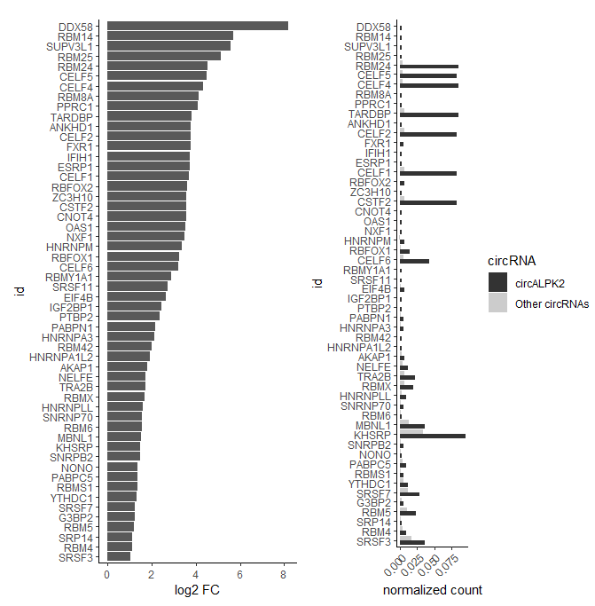

```{r, global_options, include = FALSE}
library(knitr)
library(citr)
knitr::opts_chunk$set(fig.path='figs/', warning=FALSE, message=FALSE, collapse=TRUE)
source("render_toc.R")
```

## Table of Contents

```{r, toc, echo = FALSE}
render_toc("circRNAprofiler.Rmd")
```

<style>
body {
text-align: justify}
</style>

## Introduction

circRNAprofiler, an R-based computational framework that runs after circRNAs 
have been identified. It allows to combine circRNAs detected by multiple 
publicly available circRNA detection tools and analyze their expression, 
evolutionary conservation, biogenesis and putative functions.

```{r, echo=FALSE, out.width='90%', fig.align="center", fig.cap="\\label{fig:figs} Schematic representation of the circRNA analysis workflow implemented by circRNAprofiler. In the grey box are reported the modules with the corresponding main functions."}

knitr::include_graphics("./images/image1.png")
```

This vignettes provides a guide of how to use the R package circRNAProfiler.

As practical example the RNA-sequencing data from human left ventricle tissues
previously analyzed by our group for the presence of circRNAs [@Khan.etal2016], 
was here re-analyzed. Multiple detection tools (CircMarker(cm), MapSplice2 (m)
and NCLscan (n)) were used this time for the detection of circRNAs and an additional 
sample for each condition was included reaching a total of 9 samples: 3 control
hearts, 3 hearts of patients with dilated cardiomyopathies (DCM) and 3 hearts with
hypertrophic cardiomyopathies (HCM). After the detections we run through
Module 1-3 to generate the object backSplicedJunctions and mergedBSJunctions
that will be used in this vignettes.

Raw RNA sequencing data are available at NCBI BioProject accession number 
PRJNA533243.

<!-- The data used in this tutorial has been published in... -->

## Module 1

### Install the package.

The latest version of the circRNprofiler package is available on github and it 
can be installed with:

```{r, eval = FALSE }
install.packages("devtools")
library(devtools)
install_github("Aufiero/circRNAprofiler")
```

### Load the package
```{r}
library(circRNAprofiler)

# Packages needed for the vignettes
library(ggpubr)
library(ggplot2)
library(gridExtra)
```

### initCircRNAprofiler()

An important step of the analysis workflow is to initialize the project folder,
which can be done manually or with the helper function initCircRNAprofiler ()
available in the package. The project folder should be structured as in the
example Figure 2 if seven detection tools are used to detect circRNAs in 
6 samples.

```{r, echo=FALSE, out.width='40%', fig.align="center", fig.cap="\\label{fig:figs} Project folder structure"}
knitr::include_graphics("./images/image2.png")
```

**_Manually_**

The user has to create a project folder (e.g. circRNAprofiler) and then create 
as many subfolders as the number of circRNA detection tools used. The following
options are allowed: mapsplice, nclscan, knife, circexplorer2, uroborus, circmarker 
and other. The following files are also needed: experiment.txt, motifs.txt, 
traits.txt, miRs.txt, transcripts.txt and the annotation file (*.gtf). They all
must go under the project folder circRNAprofiler. These files should be filled 
with the appropriate information (see files description below).

Then set project folder circRNAprofiler as your working directory.

**_Helper function_**

In order to initialize the project folder the helper function initCircRNAprofiler()
can be used to streamline the process. To initialize the project folder run the 
following command specifying the circRNA detection tools used. The following 
options are allowed: mapsplice, nclscan, knife, circexplorer2, uroborus, circmarker
and other. The function will automatically create the project folder with the
corresponding subfolders named with the circRNA detection tools used, and the 
5 *.txt files templates with the corresponding headers. These files should be 
filled with the appropriate information (see files description below).

If only MapSplice is used for the circRNA detection run the following command:

```{r, eval = FALSE }
initCircRNAprofiler(projectFolderName = "circRNAprofiler", predictionTools =
                      "mapsplice")
```

If circRNA detection is performed by using multiple detection tools then run
the command with the name of the detection tools used, e.g.:

```{r, eval = FALSE}
initCircRNAprofiler(
    projectFolderName = "circRNAprofiler",
    predictionTools = c("mapsplice", "nclscan", "circmarker")
)
```

Next, set project folder circRNAprofiler as your working directory.

**_txt files descritpion_**

The file **experiment.txt** contains the experiment design information.
It must have at least 3 columns with headers:

- label (1st column): unique names of the samples (short but informative).

- fileName (2nd column): name of the input files - e.g. circRNAs_X.txt, where 
x can be can be 001, 002 etc.

- condition (3rd column): biological conditions - e.g. A or B; healthy or diseased 
if you have only 2 conditions.

The functions for the filtering and the differential expression analysis depend
on the information reported in this file. The differential expression analysis 
is performed by comparing the condition positioned forward against the conditions
positioned backward in the alphabet (column condition of experiment.txt), so that,
circRNAs with positive log2FC are up-regulated in condition B compared to 
condition A (and vice versa for circRNA with negative log2FC).

```{r, echo=FALSE}
experiment <-
    read.table(
        "experiment.txt",
        header = TRUE,
        stringsAsFactors = FALSE,
        sep = "\t"
    )
knitr::kable(experiment)
```

The file ***.gtf** contains the genome annotation. circRNAprofiler works well 
and was tested with ensamble gencode, UCSC or NCBI based-genome annotations. 
It is suggested to use the same annotation file used during the read mapping 
procedure.

The file **motifs.txt** contains motifs/regular expressions specified by the user.
It must have 3 columns with headers:

- id (1st column): name of the motif. - e.g. RBM20 or motif1.
 
- motif (2nd column): motif/pattern to search.
 
- length (3rd column): length of the motif.

If this file is absent or empty only the motifs of RNA Binding Proteins in the 
ATtRACT database [@Giudice.etal2016] are considered in the motifs analysis.

```{r, echo=FALSE}
motifs <-
    read.table(
        "motifs.txt",
        stringsAsFactors = FALSE,
        header = TRUE,
        sep = "\t"
    )
knitr::kable(motifs)
```

The file **traits.txt** contains diseases/traits specified by the user. It must 
have one column with header id. Type data("gwasTraits") to have an image (dated 
on the 31st October 2018) of the traits reported in the GWAS catalog 
[@MacArthur.etal2017]. The GWAS catalog is a curated collection of all
published genome-wide association studies and contains~ 90000 unique SNP-trait 
associations. If the file traits.txt is absent or empty, all SNPs associated with
all diseases/traits in the GWAS catalog are considered in the SNPs analysis.

```{r, echo=FALSE}
traits <-
    read.table(
        "traits.txt",
        stringsAsFactors = FALSE,
        header = TRUE,
        sep = "\t"
    )
knitr::kable(head(traits))
```

The file **miRs.txt** contains the microRNA ids from miRBase [@Griffiths-Jones.etal2006]
specified by the user. It must have one column with header id. The first row
must contain the miR name starting with the ">", e.g >hsa-miR-1-3p. The 
sequences of the miRs will be automatically retrieved from the mirBase latest 
release or from the given mature.fa file,  that should be present
in the project folder. If this file is absent or empty, all miRs of the specified 
species are considered in the miRNA analysis.

```{r, echo=FALSE}
miRs <-
    read.table(
        "miRs.txt",
        header = TRUE,
        stringsAsFactors = FALSE,
        sep = "\t"
    )
knitr::kable(head(miRs))
```

The file **transcripts.txt** contains the transcript ids of the circRNA host 
genes. It must have one column with header id. If this file is empty 
the longest transcript of the circRNA host genes whose exon coordinates overlap 
with that of the detected back-spliced junctions are considered in the 
annotation analysis.

```{r, echo=FALSE}
transcripts <-
    read.table(
        "transcripts.txt",
        header = TRUE,
        stringsAsFactors = FALSE,
        sep = "\t"
    )
knitr::kable(transcripts)
```

The **circRNAs_X.txt** contains the detected circRNAs. Once the project folder 
has been initialized the circRNAs_X.txt file/s must go in the corresponding 
subfolders. There must be one .txt file per sample named circRNAs_X.txt, 
where X can be 001, 002 etc. If there are 6 samples, 6 .txt files named 
circRNAs_001.txt, circRNAs_002.txt, circRNAs_003.txt, circRNAs_004.txt, 
circRNAs_005.txt, circRNAs_006.txt must be present in each 
subfolder named with the name of the tool that has been used for the circRNA 
detection. If the detection tool used is not among the possible options, first
check that the tool used is an annotation-based circRNA detection tool,
rename the file circRNAs_X.txt and put them in the subfolder "other". 
Each circRNAs_X.txt file must have at least the following 6 columns with the
header (Figure 3):

- gene: represents the gene from which the circRNA has arisen.

- strand: is the strand where the gene is transcribed.

- chrom: represents the chromosome from which the circRNA is derived.

- startUpBSE: is the 5' coordinate of the upstream 
back-spliced exon in the transcript. This corresponds with the back-spliced junction / 
acceptor site.

- endDownBSE: is the 3' coordinate of the downstream 
back-spliced exon in the transcript. This corresponds with the back-spliced junction / 
donor site.

- coverage: corresponds to the number of reads mapping to the 
back-spliced junction in the sample. 

NOTE:
If more columns are present they will be discared.

The coordinates for startUpBSE and endDownBSE are relative to the reference 
strand, i.e. if strand is positive startUpBSE < endDownBSE, if strand is 
negative startUpBSE > endDownBSE.

For all the other detection tools, a specific import function is called 
internally to adapt and format the content as reported above. In this case you 
just need to put the files containing the detected cicRNAs in the corresponding
subfolder and change the names to circRNAs_X.txt.

The circRNAprofiler package is designed to be extended in the future with
further import functions specifically designed to import the output files of
the different circRNA detection tools. At the moment only import functions for
circRNA detection from annotation-based circRNA detection tools (e.g. MapSplice2,
NCLscan, CircMarker, CircExplorer2, KNIFE, UROBORUS) are supported.

```{r, echo=FALSE}
circRNApredictions <-
    read.table(
        "circRNAs_test.txt",
        header = TRUE,
        stringsAsFactors = FALSE,
        sep = "\t"
    )
knitr::kable(circRNApredictions)
```

### checkProjectFolder()

The function checkProjectFolder() helps to verify that the project folder is 
set up correctly.

```{r, eval = FALSE}
check <- checkProjectFolder()
check
```

If the project folder is set up correctly, check should be equal to 0.

## Module 2

### formatGTF()

The function formatGTF() formats the given annotation file from ensemble gencode,
UCSC or NCBI. The gtf object is then called in other functions. 

```{r}
# For example purpose load a short version of the already formatted annotation
# file gencode.V19.annotation.gtf (downloaded from https://www.gencodegenes.org/)
data("gtf")
head(gtf)

# Alternatively put the gtf file in the project folder, then run:
# gtf <- formatGTF(pathToGTF = "gencode.V19.annotation.gtf")
```


### getBackSplicedJunctions()

The function getBackSplicedJunctions() reads the circRNAs_X.txt, adapts the 
content and generates a unique data frame with the circRNAs detected by each 
detection tool and the occurrences found in each sample. If antisense circRNAs
are detected, they are removed from the data frame and stored in a file 
(antisenseCircRNAs.txt) for user consultation. A circRNA is defined antisense
if the strand reported in the prediction results is different from the strand 
reported in the genome annotation file. 


```{r, eval= FALSE}
# Load the object containing the detected circRNAs
data("backSplicedJunctions")
head(backSplicedJunctions)

# Alternatively run:
# backSplicedJunctions <- getBackSplicedJunctions(gtf)
```

Plot the number of circRNAs identified by each detection tool.

```{r, fig.align="center", fig.width = 10, fig.height = 3}
# Plot
p <- ggplot(backSplicedJunctions, aes(x = tool)) +
    geom_bar() +
    labs(title = "", x = "Detection tool", y = "No. of circRNAs") +
    theme_classic()

dt <- getDetectionTools() %>%
    dplyr::filter( name %in% c("mapsplice","nclscan", "circmarker"))%>%
    gridExtra::tableGrob(rows=NULL)

# Merge plots
gridExtra::grid.arrange(p, dt, nrow=1)
```

## Module 3

### mergedBSJunctions()

The function mergeBSJunctions() is called to shrink the data frame by grouping 
back-spliced junction coordinates commonly identified by multiple detection tools.
For the grouped back-spliced junction coordinates, the counts of the tool which 
detected the highest total mean across all analyzed samples will be taken. 
All the tools that detected the back-spliced junction are then listed in the 
column "tool" of the final table. Run getDetectionTools() to get the code
correspoding to each circRNA detection tool.

```{r}
# Load object containing the merged back-spliced junctions
data("mergedBSJunctions")
head(mergedBSJunctions)

# Alternatively run:
# mergedBSJunctions <-
# mergeBSJunctions(backSplicedJunctions, gtf)
```

Plot commonly identified circRNAs.

```{r, fig.align = "center", fig.width = 10, fig.height = 4}
# Plot
p <- ggplot(mergedBSJunctions, aes(x = tool)) +
    geom_bar() +
    labs(title = "", x = "Detection tool", y = "No. of circRNAs") +
    theme_classic()

# Run getDetectionTools() to get the code corresponding to the circRNA 
# detection tools.
dt <-getDetectionTools() %>%
    dplyr::filter( name %in% c("mapsplice","nclscan", "circmarker"))%>%
    gridExtra::tableGrob(rows=NULL)

# Merge plots
gridExtra::grid.arrange(p, dt, nrow=1)

```

## Module 4

### filterCirc()

The use of multiple detection tools leads to the identification of a higher number
of circRNAs. To rule out false positive candidates a filtering step can be applied
to the detected circRNAs.  The function filterCirc() filters circRNAs on
different criteria: condition and read counts. In the example below
by setting allSamples = FALSE the filter is applied to the samples of each condition
separately meaning that a circRNA is kept if at least 5 read counts are present
in all samples of one of the conditions (A or B or C). If allSamples = TRUE, the filter 
is applied to all samples. We suggest to set allSamples = FALSE, since the presence
of a disease/treatment can decrease the expression of subset of circRNAs
thus by applying the filtering to all samples(allSamples = TRUE) those circRNAs 
are discarded. 

```{r}
filteredCirc <-
filterCirc(mergedBSJunctions, allSamples = FALSE, min = 5)
```

Plot circRNAs after the filtering step.

```{r, fig.align="center", fig.width = 10, fig.height = 4}
# Plot
p <- ggplot(filteredCirc, aes(x = tool)) +
    geom_bar() +
    labs(title = "", x = "Detection tool", y = "No. of circRNAs") +
    theme_classic()

# Run getDetectionTools() to get the code corresponding to the circRNA
# detection tools.
dt <-getDetectionTools() %>%
    dplyr::filter( name %in% c("mapsplice","nclscan", "circmarker"))%>%
    gridExtra::tableGrob(rows=NULL)

# Merge plots
gridExtra::grid.arrange(p, dt, nrow=1)
```

## Module 5

### getDeseqRes()

The helper functions getDeseqRes() identifies differentially expressed
circRNAs. The latter uses the R Bioconductor packages DESeq2 which 
implement a beta-binomial model to model changes in circRNA expression. The 
differential expression analysis is performed by comparing the condition positioned
forward against the condition positioned backward in the alphabet (values in the 
column condition in experiment.txt). E.g. if there are 2 conditions A and B then 
a negative log2FC means that in the conditions B there is a downregulation of the
corresponding circRNA. If a positive log2FC is found means that there is an 
upregulation in the condition B of that circRNA.

```{r}
# Compare condition B Vs A
deseqResBvsA <-
    getDeseqRes(
        filteredCirc,
        condition = "A-B",
        fitType = "local",
        pAdjustMethod = "BH"
    )
head(deseqResBvsA)
```

```{r}
# Compare condition C Vs A
deseqResCvsA <-
    getDeseqRes(
        filteredCirc,
        condition = "A-C",
        fitType = "local",
        pAdjustMethod = "BH"
    )
head(deseqResCvsA)
```

Use volcanoPlot() function

```{r, fig.align="center", fig.height= 8, fig.width = 8}
# We set the xlim and ylim to the same values for both plots to make them
# comparable. Before setting the axis limits, you should visualize the 
# plots with the default values to be able to define the correct limits 
p1 <-
    volcanoPlot(
        deseqResBvsA,
        log2FC = 1,
        padj = 0.05,
        title = "DCMs Vs. Con",
        setxLim = TRUE,
        xlim = c(-8 , 7.5),
        setyLim = FALSE,
        ylim = c(0 , 4),
        gene = FALSE
    )
p2 <-
    volcanoPlot(
        deseqResCvsA,
        log2FC = 1,
        padj = 0.05,
        title = "HCMs Vs. Con",
        setxLim = TRUE,
        xlim = c(-8 , 7.5),
        setyLim = TRUE,
        ylim = c(0 , 4),
        gene = FALSE
    )
ggarrange(p1, 
          p2, 
          ncol = 1, 
          nrow = 2)
```

### getEdgerRes()

The helper functions edgerRes() identifies differentially expressed 
circRNAs. The latter uses the R Bioconductor packages EdgeR which
implement a beta-binomial model to model changes in circRNA expression. The 
differential expression analysis is perfomed by comparing the condition positioned
forward against the condition positioned backward in the alphabet (values in the
column condition of experiment.txt). E.g. if there are 2 conditions A and B then
a negative log2FC means that in the conditions B there is a downregulation of 
the corresponding circRNA. If a positive log2FC is found means that there is 
an upregulation in the condition B of that circRNA.

```{r,eval = FALSE}
# Compare condition B Vs A
edgerResBvsA <-
    getEdgerRes(
        filteredCirc,
        condition = "A-B",
        normMethod = "TMM",
        pAdjustMethod = "BH"
    )
head(edgerResBvsA)
```

```{r,eval = FALSE}
# Compare condition C Vs A
edgerResCvsA <-
    getEdgerRes(
        filteredCirc,
        condition = "A-C",
        normMethod = "TMM",
        pAdjustMethod = "BH"
    )
head(edgerResCvsA)
```

## Module 6

### liftBSJCoords()

The function liftBSJCoords() converts back-spliced junction coordinates between
different species and genome assemblies by using the liftOver utility from UCSC.
Type data(ahChainFiles) to see all possibile options for annotationHubID 
E.g. if AH14155 is specified, the hg19ToMm9.over.chain.gz will be used to 
convert the hg19 (Human GRCh37) coordinates to mm9 (Mouse GRCm37). 

NOTE:
NA values in the table means that the conversion failed, that is
the exons that are back-spliced in human are not conserved to mouse.

```{r, eval = FALSE}
liftedBSJCoords <- liftBSJCoords(filteredCirc, map = "hg19ToMm9",
                                 annotationHubID = "AH14155")
```

## Module 7

### annotateBSJs()

The function annotateBSJs() annotates back-splicing junctions with 
the user provided gene annotation. We first define the circRNA parental transcript
as a linear transcript whose exon coordinates overlap with that of the detected 
back-spliced junctions and then the features are extracted from the selected
transcript. Since the coordinates of the detected back-spliced junctions might
not exactly correspond to annotated exonic coordinates, a gap of 10 nucleotides 
is allowed. As default, in situations where genes have multiple transcripts 
whose exons align to the back-spliced junction coordinates, the transcript that 
will produce the longest sequence (exon only) will be selected. Alternatively,
the transcript to be used can be specified in transcripts.txt.
The output data frame will have the following columns:

- id: unique identifier.

- gene: represents the gene from which the circRNA has arisen.

- allTranscripts: are all transcripts of a circRNA's host gene which exon coordinates
overlap with the detected back-spliced junction coordinates.

- transcript: as default, this is the transcript producing the longest sequence
and whose exon coordinates overlap with the detected back-spliced junction coordinates.
The transcript reported in this column is used in the downstream analysis. 

- totExons: total number of exons in the selected transcript (reported in the column 
"transcript")

- strand: is the strand where the gene is transcribed.

- chrom: is the chromosome from which the circRNA is derived.

- startUpIntron: is the 5' coordinate of the intron upstream the acceptor site 
in the selected transcript.

- endUpIntron: is the 3' coordinate of the intron upstream the acceptor site
in the selected transcript.

- startUpBSE: is the 5' coordinate of upstream back-spliced exon in the selected
transcript. This corresponds with the upstream back-spliced junction / acceptor site.

- endUpBSE: is the 3' coordinate of the upstream back-spliced exon in the selected
transcript.

- startDownBSE: is the 5' coordinate of downstream back-spliced exon in the selected
transcript.

- endDownBSE: is the 3' coordinate of downstream back-spliced exon in the selected
transcript. This corresponds with the downstream back-spliced junction / donor site.

- startDownIntron: is the 5' coordinate of the intron downstream the donor site
in the selected transcript.

- endDownIntron: is the 3' coordinate of the intron downstream the donor site
in the selected transcript.

- exNumUpBSE: is the position of the upstream back-spliced exon in the selected
transcript (e.g. if it is the 1st, the 2nd etc).

- exNumDownBSE: is the position of the downstream back-spliced exon in the selected
transcript (e.g. if it is the 1st, the 2nd etc).

- numOfExons: is the total number of exons in the between the back-spliced junctions.

- lenUpIntron: is the length (nt) of the intron upstream the acceptor site 
in the selected transcript.

- lenUpBSE: is the length (nt) of the upstream back-spliced exon in the selected
transcript.

- lenDownBSE: is the length (nt) of the downstream back-spliced exon in the selected
transcript.

- lenDownIntron: is the length (nt) of the intron downstream the donor site 
in the selected transcript.

- meanLengthBSEs: is the mean lenght (nt) of the back-spliced exons.

- meanLengthIntrons: is the mean lenght (nt) of the introns flanking the 
detected back-spliced junctions.

- lenCircRNA: is the length (nt) of the circRNA. This is given by the length of 
the exons in between the back-spliced junctions, including the back-spliced exons.


NOTE:
NA values in the table can mean:

- the back-spliced exons are the first or the last within a transcript, so the
introns in these cases are not present.

- the back-spliced junctions do not match with any exon coordinates reported in 
the annotation file. It is important to use the same annotation file (*.gtf file)
used during the read mapping procedure since the same gene can be differently 
annotated by the existing annotation databases [@Zhao.Zhang2015].

 
```{r}
# As an example of the 1458 filtered circRNAs we annotate only the firt 30 
# circRNAs
annotatedBSJs <- annotateBSJs(filteredCirc[1:30,], gtf) 
head(annotatedBSJs)
```

## Module 8

### getRandomBSJunctions()

The function getRandomBSJunctions() retrieves random back-spliced junctions 
from the user genome annotation.  Two random back-spliced exons are selected 
from each of the n randomly selected transcripts, and the back-spliced junction
coordinates reported in the final data frame. The frequency of single exon circRNAs 
can also be given as argument. If f = 10, 10% of the of the back-spliced junctions
belong to single exons. Randomly selected back-spliced junctions can be used as
background data set for structural and functional analysis. 

```{r}
# First find frequency of single exon circRNAs
f <-
    sum((annotatedBSJs$exNumUpBSE == 1 |
             annotatedBSJs$exNumDownBSE == 1) ,
        na.rm = TRUE) / (nrow(annotatedBSJs) * 2)

# Retrieve random back-spliced junctions
randomBSJunctions <-
    getRandomBSJunctions(n = nrow(annotatedBSJs), f = f, gtf)
head(randomBSJunctions)
```

Annotate randomly selected back-spliced junctions.

```{r, eval = FALSE} 
annotatedRBSJs <- annotateBSJs(randomBSJunctions, gtf, isRandom = TRUE)
```

Use the plot functions to plot all the features of the annotated back-spliced-junctions.

```{r, fig.align="center", fig.width = 10, fig.height = 7, eval = FALSE}
# annotatedBSJs act as foreground data set
# annotatedRBSJs act as background data set

# Length of flanking introns
p1 <- plotLenIntrons(
    annotatedBSJs,
    annotatedRBSJs,
    title = "Length flanking introns",
    df1Name = "detected",
    df2Name = "random"
)

# Length of back-splided exons
p2 <- plotLenBSEs(
    annotatedBSJs,
    annotatedRBSJs,
    title = "Length back-splided exons",
    df1Name = "detected",
    df2Name = "random"
)

# No. of circRNAs produced from the host genes
p3 <-
    plotHostGenes(annotatedBSJs, title = "# CircRNAs produced from the host genes")

# No. of exons in between the back-spliced junctions
p4 <-
    plotExBetweenBSEs(annotatedBSJs, title = "# Exons between back-spliced junctions")

# Position of back-spliced exons within the host transcripts
p5 <-
    plotExPosition(annotatedBSJs,
                   flip = FALSE,
                   n = 1,
                   title = "Position back-spliced exons in the transcripts")

# Additional plotting functions
# Position of back-spliced exons within the flipped host transcripts
p6 <-
    plotExPosition(annotatedBSJs,
                   flip = TRUE,
                   n = 1,
                   title = "Position back-spliced exons in the flipped transcripts")

# Total no. of exons within the host transcripts
p7 <-
    plotTotExons(annotatedBSJs, title = " Total number of exons in the transcripts")

# Combine plots
ggarrange(p1,
          p2,
          p3,
          p4,
          p5,
          ncol = 2,
          nrow = 3)

```


```{r, echo=FALSE, out.width='100%', fig.align="center", fig.cap="\\label{fig:figs} Comparison of structural features extracted from the subset of 1458 filtered  back-spliced junctions compared to an equal number of randomly generated back-spliced junctions."}
knitr::include_graphics("./images/image3.png")
```


Functional screenings can be perfomed on one or multiple circRNAs (e.g 
differentially expressed circRNAs or circRNAs arising from the same host genes).
We selected ALPK2 circRNA for further functional screenings.

```{r, eval = FALSE}
# Select ALPK2:-:chr18:56247780:56246046 circRNA
annotatedCirc <-
annotatedBSJs[annotatedBSJs$id == "ALPK2:-:chr18:56247780:56246046", ]

# As background data set we used all the remaining 1457 filered circRNAs.
# Alternatively the subset of randomly generated back-spliced junctions can be used.
annotatedBackgroundCircs <-
annotatedBSJs[which(annotatedBSJs$id != "ALPK2:-:chr18:56247780:56246046"), ]
```

CircRNA sequences, back-spliced junction sequences only or sequences flanking 
the back-spliced junctions can be used for downstream functional analysis 
The sequences are retrieved from UCSC database. Default query sequence corresponds
to the positive strand of the DNA (5'->3'). For all the circRNAs arising from 
genes located on the negative strand, the sequences are complemented and subsequently
reversed since the reference direction is 5'->3'. Sequences are only retrieved for
back-spliced junctions that overlap with exon boundaries of at least one 
transcript (see annotateBSJs()).  

## Module 9

### getCircSeqs()

The function getCircSeqs() retrieves the internal circRNA sequences. By default,
the circRNA sequences are the sequences of all the exons between 
the back-spliced-junctions. The exon sequences are retrieved and then concatenated
together to recreate the circRNA sequence. To recreate the back-spliced junction 
sequence 50 nucleotides are taken from the 5' head and attached at the 3' tail 
of each circRNA sequence. This makes the circRNA sequences reported in the output
file longer than the actual length. 

```{r,eval = FALSE}
# Foreground target sequences
targetsFTS_circ <-
    getCircSeqs(annotatedCirc, gtf, species = "Hsapiens", genome = "hg19")

```

## Module 10

### getSeqsAcrossBSJs()

The function getSeqsAcrossBSJs() can be used to retrieve the sequences across
the back-spliced junctions.  A total of 11 nucleotides from each side of the
back-spliced junction are taken and concatenated together.

```{r, eval = FALSE}
# Foreground target sequences
targetsFTS_bsj <-
    getSeqsAcrossBSJs(annotatedCirc, gtf, species = "Hsapiens", genome = "hg19")

```

## Module 11

### getSeqsFromGRs() 

The function getSeqsFromGRs() includes 3 modules to retrieve the 3 types of sequences.
Sequences of the introns flanking back-spliced junctions, sequences from a defined 
genomic window surrounding the back-spliced junctions and sequences of the 
back-spliced exons. If type = "ie" the sequences are retrieved from the genomic 
ranges defined by using the values given in input to lIntron and lExon. If 
type = "bse" the sequences of the back-spliced exons will be extracted.
If type = "fi" the sequences of the introns flanking the back-spliced exons are
retrieved.

```{r, eval = FALSE}
# Foreground target sequences
targetsFTS_gr <-
    getSeqsFromGRs(
        annotatedCirc,
        lIntron = 200,
        lExon = 9,
        type = "ie",
        species = "Hsapiens",
        genome = "hg19"
    )
# Background target sequences.
targetsBTS_gr <-
    getSeqsFromGRs(
        annotatedBackgroundCircs,
        lIntron = 200,
        lExon = 9,
        type = "ie",
        species = "Hsapiens",
        genome = "hg19"
    )
```


## Module 12

### getMotifs()

The function getMotifs() scans the target sequences for the presence of recurrent
motifs of a specific length defined in input. The sequences flanking the back-spliced
junctions, circRNA sequences or the back-spliced junction sequences can be analyzed.
Briefly, we first compute all possible motifs of a given length (defined by 
the argument width of the function), and then the RNA target sequences is scanned
for the presence of those motifs. Also overlapping motifs are counted. 
The identified motifs can subsequently be matched with motifs of known RNA Binding 
Proteins (RBPs) deposited in the ATtRACT database. 
There can be multiple consensus binding motifs for each RBP ranging from 4 to 12
nucleotides. If the identified motifs matches with or they are contained 
(as substring) within any RBP motifs it is marked and named with the name of 
the matching RBP. A motif can be shared by multiple RBPs, so in that case all 
RBPs are reported. It is possible to specify whether to report only motifs 
matching with RBPs or unknown motifs. By setting rbp = TRUE, only motifs matching with
known RBP motifs are reported. By setting reverse = TRUE, all the RBP motifs in 
the ATtRACT data base and custom motifs reported in motifs.txt are reversed and 
analyzed together with the direct motifs as they are reported in the ATtRACT db 
and motifs.txt. Location of the selected motifs is also reported. This 
corresponds to the start position of the motif within the sequence (1-index based).

```{r, eval = FALSE}
# Find motifs in the foreground target sequences
motifsFTS_gr <-
    getMotifs(targetsFTS_gr,
              species = "Hsapiens",
              width = 6,
              rbp = TRUE,
              reverse = FALSE)
# Find motifs in the background target sequences
motifsBTS_gr <-
    getMotifs(targetsBTS_gr,
              species = "Hsapiens",
              width = 6,
              rbp = TRUE,
              reverse = FALSE)
```

### mergeMotifs()

The function mergeMotifs() groups all the motifs recognized by the same RBP and 
report the total counts.

```{r, eval = FALSE}
mergedMotifsFTS_gr <- mergeMotifs(motifsFTS_gr)
mergedMotifsBTS_gr <- mergeMotifs(motifsBTS_gr)
```

Retrieve and plot log2FC and counts of the motifs found in the target sequences 
(e.g. background and foreground). Adjust the normalization factors to 
the number of sequences of each group (if different).

```{r, fig.align="center", fig.width = 7, fig.height = 7, eval = FALSE}
# Plot
p <-
    plotMotifs(
        mergedMotifsFTS_gr,
        mergedMotifsBTS_gr,
        nf1 = nrow(annotatedCirc),
        nf2 = nrow(annotatedBackgroundCircs),
        log2FC = 1,
        df1Name = "circALPK2",
        df2Name = "Other circRNAs"
    )
ggarrange(p[[1]],
          p[[2]],
          labels = c("", ""),
          ncol = 2,
          nrow = 1)

```

```{r, echo=FALSE, out.width='80%', fig.align="center", fig.cap="\\label{fig:figs} Bar chart showing the log2FC (cut-off = 1) and the counts of the RBP motifs found in the region flanking the predicted back-spliced junctions of circALPK2 compared to the remaining 1457 detected circRNAs."}

```

```{r, eval = FALSE}
# Type p[[3]] to get table
head(p[[3]])
```

The data frame contains the following columns:
- foreground: number of motif found in the foreground target sequences.

- background: number of motifs found in the background target sequences.

- foregroundNorm: number of motif found in the foreground target sequences and
normalized for the number of sequences analyzed.

- backgroundNorm: number of motifs found in foreground target sequences and
normalized for the number of sequences analyzed.

- log2FC: log2 fold change calculated in this way (foregroundNorm+1)/(backgroundNorm+1).

- motif: motif of the corresponding RBP.

It is also possible to search for RBP motifs and unknown motifs in circRNA 
sequences and back-spliced junction sequences. For this purpose the target sequences
have to be retrieved and then the functions getMotifs() and mergeMotifs() have 
to be run, as described above.
    
## Module 13

### getMiRsites()

The function getMirSites() searches miRNA binding sites within circRNA sequences.
Briefly, circRNAprofiler queries  the miRBase database
and retrieves the miRNA sequences which are subsequently reversed (3'->5'). 
Each circRNA sequence is then scanned using a sliding window of 1, for the 
presence of putative matches with the miRNA seed sequence.  
For each iteration, the number of total matches (canonical Watson-Crick (WC) + 
non-canonical matches), continuous canonical WC matches and
non-canonical matches between the 2 given sequences (seed region and target 
sequence) are retrieved. A WC match occurs when adenosine (A) pairs with uracil 
(U) and guanine (G) pairs with cytosine (C). A perfect seed match between the 
miRNA and the target has no gaps in alignment within the WC matching. A non-canonical
match occurs when a G matches with U. A mismatch occurs when there is a gap in
one of the two sequences (asymmetric mismatch) or in the following cases 
(symmetric mismatch): A-G or A-C or U-C. Only seed sites that meet specific 
matching requirements are collected and reported in the final output. 
Of those seed sites, additional features are also reported, 
such as the number of matches found between the circRNA sequences and the 
central and supplementary regions of the miRNA. Information about the 
nucleotide at position 1 (t1), that is the nucleotide in the circRNA sequence 
that matches with the nucleotide number 1 of the miRNA sequence.  Finally,
the percentage of AU nucleotides around the seed site is reported. 
The output is a list of data frames where each data frame contains the 
information relative to one circRNA. The following columns are present:

- miRseqRev: miRNA sequence used in the analysis; 
e.g. 3'GAUUCGGUGGUACACUUUGGUC5'; GUGG: compensatory region (13-16); 
UACA: central region (9-12); CUUUGGU: seed (8-2).

- counts: is the number of times a miRNA seed region is found in the target sequence.

- totMatchesInSeed: is the number of total matches (canonical WC + non-canonical matches)
found between the miRNA seed region and the seed site in the target sequence.

- cwcMatchesInSeed: is the number of continuous WC matches found between the miRNA
seed region and the seed site in the target sequence.

- seedLocation: is the location of the seed site in the target sequence. 
E.g. if the reported number is 20 it means that the nucleotide at position 20 in 
the target sequence (1-index based) matches with the nucleotide number 8 of the
miRNA. From 21 to 26 one can find the rest of the seed sequence. For the central 
region one has to look from position 16 to 19 and for the compensatory region 
from position 12 to 15 of the target sequence.

- t1: is the nucleotide in the target sequence that matches with nucleotide 
number 1 (C5') of the miRNA sequence.

- totMatchesInCentral: is the number of total matches (canonical WC + non-canonical matches)
found between the miRNA central region and the region upstream the seed site in the
target sequence (e.g. position 16 to 19).

- cwcMatchesInCentral: is the number of continuous WC matches found between the 
miRNA central region and the region upstream the seed site in the target sequence 
(e.g. position 16 to 19).

- totMatchesInCompensatory: is the number of total matches found between the miRNA
compensatory region and the region upstream the seed site in the target sequence 
(e.g. position 12 to 15).

- cwcMatchesInCompensatory: is the number of continuous WC matches found between
the miRNA compensatory region and the region upstream the seed site in the target
sequence (e.g. position 12 to 15).

- localAUcontent: is the percentage of AU nucleotides in the 10 nucleotides upstream
and downstream the seed site in the target sequence.


How to interpret the results?
The user can select stringency criteria for miRNA binding prediction. 
For example by setting the function arguments (specific for the seed site) 
totalMatches = 7 and maxNonCanonicalMatches = 1, one can retrieve only seed 
sites with a number of total matches with the miRNA seed region equal to 7 of 
which only 1 can be a non-canonical match. In this case after running the 
analysis, totMatchesInSeed must be 7, if cwcMatchesInSeed is 4mer it means 
that there are 7 matches between the seed site in the target 
sequence and the miRNA seed region, with 1 non-canonical match in the middle of 
alignment, that is: there are 4 continuous WC matches (4mer), 1 non-canonical 
match and 2 continuous WC matches, for a total of 7. 

Furthemore, for the selected site, let's assume that for the central and 
compensatory region, the maximum number of matches found with the target sequence
is 4 for both of them. In this case if totMatchesInCentral is 4 but 
cwcMatchesInCentral is 3 it means that there are 3 continuous WC matches with
1 non-canonical match, for a total of 4. 
Alternatively if totMatchesInCentral is 3 but cwcMatchesInCentral is 2 it means
that there are 2 continuous WC matches, 1 non-canonical match for a total of 3 
and 1 gap. The same rule is valid for totMatchesInCompensatory and 
cwcMatchesInCompensatory.


The miRNA analysis starts at position 30 of the circRNA sequence to allow the 
analysis of the complementary and 3' supplementary region of the miRNA that have
to be aligned with the region located backwards the selected seed site.
The 30 nucleotides skipped in the initial phase are analyzed in the final phase
together with the back-spliced junction. The computational time increases with 
the number of sequences and miRNAs to analyze. To reduce false positives and 
computational time we suggest making a selection on miRNAs, e.g. use only miRNAs
expressed in the tissues of interest.

```{r,eval = FALSE}
miRsites <-
    getMiRsites(
        targetsFTS_circ,
        species = "Hsapiens",
        genome = "hg19",
        miRspeciesCode = "hsa",
        miRBaseLatestRelease = TRUE,
        totalMatches = 6,
        maxNonCanonicalMatches = 1   
    )
  
```

### rearrageMiRresults()

The function rearrangeMirResults() rearranges the results of the getMiRsites() 
function.

```{r,eval = FALSE}
rearragedMiRres <-
    rearrangeMiRres(
        miRsites,
        n = 40,
        color = "blue",
        miRid = TRUE,
        id = 1
    )
```

Store results in an excel file

```{r, eval=FALSE}
# If multiple circRNAs have been anlyzed for the presence of miR binding sites
# the following code can store the predictions for each circRNA in a 
# different sheet of an xls file for a better user consulation.
i <- 1
j <- 1
while (i <= (length(rearragedMiRres))) {
    write.xlsx2(
        rearragedMiRres[[i]][[1]],
        "miRsites_TM7_NCM0.xlsx",
        paste("sheet", j, sep = ""),
        append = TRUE
    )
    j <- j + 1
    write.xlsx2(
        rearragedMiRres[[i]][[2]],
        "miRsites_TM7_NCM0.xlsx",
        paste("sheet", j, sep = ""),
        append = TRUE
    )
    i <- i + 1
    j <- j + 1
}

```

The function plotMir() can be used to visualize the miR results of 1 circRNA 
at the time. By setting id = 1 the the miR results of the first element of the 
list rearragedMiRres are plotted.

```{r, eval = FALSE}
p <- plotMiR(rearragedMiRres,
             n = 40,
             color = "blue",
             miRid = TRUE,
             id = 1)
p
```


## Module 14

### annotateSNPsGWAS()

The function annotateSNPsGWAS() can be used to annotate the GWAS SNPs located 
in the region flanking the back-spliced junctions of each circRNA. SNPs information
including the corresponding genomic coordinates are retrieved from the GWAs catalog
database. The genomic coordinates of the GWAS SNPs are overlapped with the 
genomic coordinates of the target sequences. This is possible only for human genome.

```{r, eval = FALSE}
snpsGWAS <- annotateSNPsGWAS(targetsFTS_gr, genome = "hg19")

```

## Module 15

### annotateRepeats() 

The function annotateRepeats() annotates repetitive elements 
located in the region flanking the back-spliced junctions of each circRNA. 
Briefly, the genomic coordinates of repetitive elements in the RepeatMasker 
database are overlapped with the genomic coordinates of the target sequences.
If compementary = TRUE, only back-spliced junctions of circRNAs which flanking 
introns contain complementary repeats (repeats belonging to a same 
family but located on opposite strands) are reported in the final output.
Repetitive elements are provided by AnnotationHub storage which
collected repeats from RepeatMasker database. Type data(ahRepeatMasker) to see 
all possibile options for annotationHubID. If "AH5122" is
specified, repetitve elements from Homo sapiens, genome hg19 will be
downloaded and annotated.

```{r, eval = FALSE}
repeats <-
    annotateRepeats(targetsFTS_gr, annotationHubID = "AH5122", 
                    complementary = TRUE)
```

## Support

We work hard to ensure that circRNAprofiler is a powerful tool empowering your
research. However, no software is free of bugs and issues, therefore we would 
love to get feedback from our users. We intend to add more modules in
the future in order to provide a comprehensive R package and also encourage users
to contribute modules to circRNAprofiler.

## Acknowledgement

We thank Engr. Dario Zarro and the member of the YP group for helpful discussion.  

## Note

```{r}
sessionInfo()
```

## References
